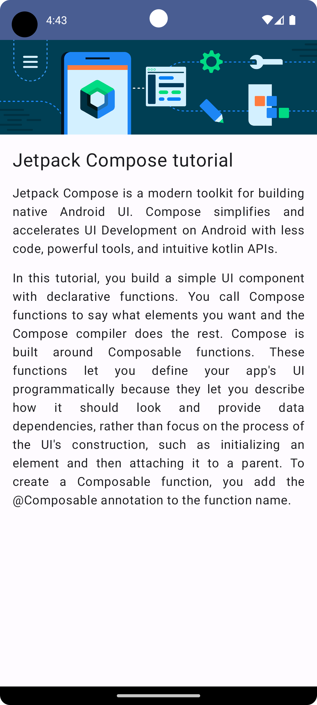
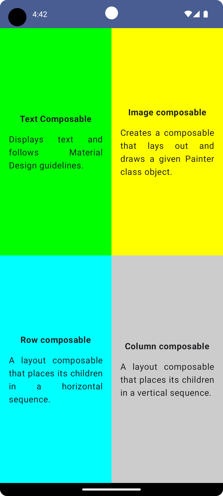
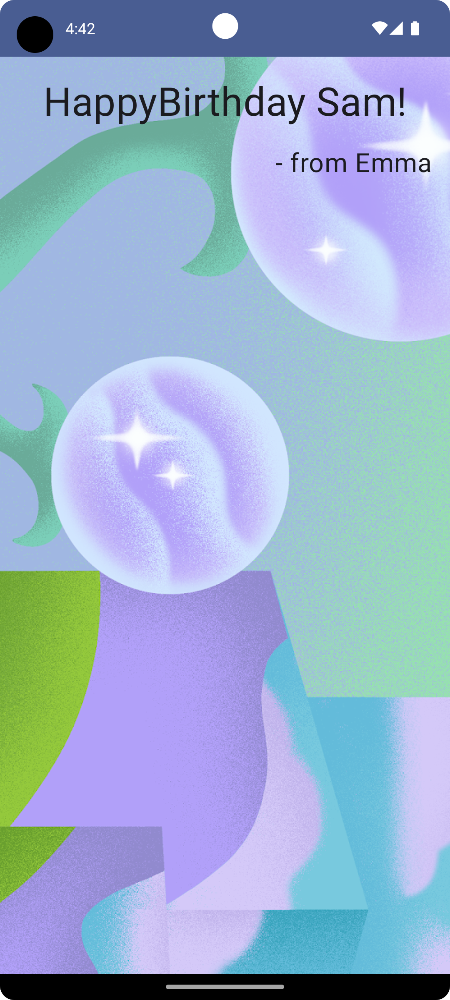
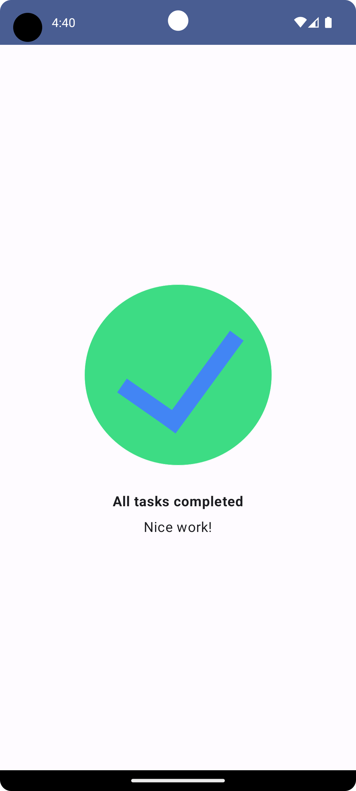

# Codelab-jetpack-myanswer

### 概要
Google Codelabに存在しているJetpackCompose(レイアウト編)を完走したのでその成果をアップしたもの。4つのAndroid Studioプロジェクトを含んでいる。それぞれの内容は次の通り
| フォルダ名　| Compose Article | Compose Quadrant | Happy Birthday | Task Manager |
| :---: | :---: | :---: | :---: | :---: |
| スクリーンショット |  |  |  |  |
| 概要 | Jetpack Composeについての紹介テキストとそのヘッダを表示するもの | 画面領域を４分割し、それぞれに別の背景色を設定するもの | 誕生日を祝う画像とテキストを表示するためのもの | Taskmanagerアプリを想定したもの。タスクコンプリートを祝うものが表示される。|